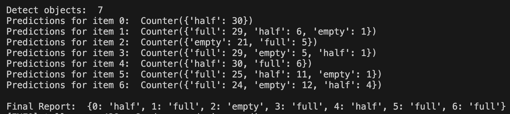

# Liquid Level Detection with Drone

This script enables the detection of liquid levels (empty, half, full) using drone technology and YOLOv5. It can be applied in various scenarios, such as beverage packaging factories or chemical facilities, to monitor and manage liquid levels effectively. We also integrated the drone-based liquid level detection system into industrial settings, improving production quality control by identifying bottles with incorrect liquid levels, thereby ensuring product quality compliance and increasing efficiency.

# Demonstration
This video is a short demo of the navigation system integrated with liquid level detection feature.


The final detection report will be sent to the user for reference.




For more detailed drone demo, click on this [video link](https://www.youtube.com/watch?v=s8gKVEfDRzM).

## Setup
Follow these instructions to set up the project on your local machine:

1. Clone this Repository
Clone this repository to your local
```
git clone https://github.com/ChenFengTsai/Liquid_Level_Drone.git
```

2. Fork the YOLOv5 Repository

Fork the YOLOv5 repository to your own GitHub account.

3. Clone the Forked YOLOv5 Repository

Go to the project directory and clone your forked YOLOv5 repository to your project directory:
```
git clone https://github.com/your-username/yolov5.git
```

4. Install Dependencies

If you are using Poetry for package management, run the following command to install the project dependencies:
```
grep -vE '^\s*#' requirements.txt | xargs -n 1 poetry add -D
```

Alternatively, you can use pip to install the dependencies from the `requirements.txt` file:
```
pip install -r requirements.txt
```

5. Create a Virtual Environment (Optional)

If you are not using Poetry and prefer a virtual environment, you can create one with the following command:
```
poetry shell
```

6. Configuration File

Create a `config.ini` file that includes your API key, Tello IP, and WiFi IP.

7. Connect to the Drone

Connect to your drone and ensure it's connected to your computer through the wifi. (Run drone_utils.py to connect your drone to the private wifi)
```
python3 drone_utils.py
```

8. Run Detection

Execute the drone_detect.py file to see the detection results. You can choose among mock execution, control with the keyboard and speech recognition. To change the execution mode, use different argparse parameters in the command line:

### Command-Line Parameters

- `--control_with_kb`: Enable keyboard control if specified
- `--mock`: Use mock execution of drone commands if specified
- `--save_video`: Save video after running the experiment if specified

Command Line Example:
```
python3 drone_detect.py --control_with_kb --save_video
```

If control_with_kb is specified, it will be in keyboard control model and below are the keyboard shortcuts for reference.

### Keyboard Shortcuts:

* w: Move forward
* s: Move backward
* d: Move right
* a: Move left
* e: Move up
* q: Move down
* k: Rotate clockwise
* j: Rotate counter-clockwise
* z: Navigation
* t: Save out the experiment result
* Space: Takeoff
* Esc: Land

9. Configure Keyboard Control on Mac

If you want to use the keyboard to control the drone on Mac, follow these steps:

Go to System Preferences > Privacy Tab > Accessibility.
Add Terminal and your preferred IDE to the list of apps with accessibility access.


## Training on Customized Data
If you want to let the model to detect other objects, you can follow the steps below.
1. Image Data Annotation
Annotate the dataset with labeling tool VGG Image Annotator (VIA) by outlining bounding boxes around containers within the images, and then save the annotation out as `annotations.csv` file

2. Dataset Setup
```
dataset
     |—image
         |—image_1.jpg
     |annotations.csv
```

3. Data Preparation
Run the data preparation script to reformat and normalized the labels and image data.
```
python3 data_prep.py
```

4. Training
Train the YOLOv5 model using the following command. Make sure to adjust the directory name in your YAML file and any other necessary arguments:
```
python3 yolov5/train.py --img 640 --batch 16 --epochs 100 --data liquid.yaml --cfg yolov5/models/yolov5s.yaml
```

## License
This project is licensed under the GNU General Public License v3.0 (GPL-3.0). The full text of the license can be found in the [LICENSE](LICENSE) file.

## Disclaimer
* Use the script responsibly and in compliance with local laws and regulations.
* Be cautious when operating a drone to ensure safety.
* The script is provided as-is, without any warranty.


